<h1>&nbsp; Eden</h1>

A revival of the classic **AOSP Launcher3**, rewritten in Kotlin, for people who are tired of being
told how their own home screen works.

Somewhere between Android 7 and now, launchers stopped asking. The grid is the grid. The drawer
scrolls the way it scrolls. Your home page is the leftmost one, because it just is. Empty screens
get deleted out from under you, because surely you did not mean to have one. Every OEM ships its
own idea of correct, buries the settings somewhere different, and half the time removes them.

Eden gives that back. Every one of those is a setting, and the defaults are only defaults.

---

## What it does

- **Home screen** with pages you control. Add one, delete one, or keep one deliberately empty
  because you like seeing your wallpaper. Long-press to zoom out into overview and manage them as
  cards, the way Launcher3 always did it.
- **Pick your home page.** Keep the middle one as home and have pages either side of it. Tap the
  little house on any card in overview. Stock Android has never let you do this without replacing
  the whole launcher; here it is one tap.
- **An app drawer that works your way** - fling vertically through one continuous grid, or swipe
  through fixed pages. Same apps, same search, your choice of gesture. Set the background anywhere
  from fully opaque to fully transparent so your wallpaper shows through.
- **Drag and drop** icons between pages and the dock, stack two icons to make a folder, drag to
  Remove to get rid of one.
- **Your grid, your icons.** Columns, rows, dock size, icon size, spacing, label gap - all
  adjustable, all with an Auto that just works if you would rather not think about it.
- **Eleven live wallpapers**, rewritten from the AOSP originals that Android stopped shipping - Phase
  Beam, Noise Field, Galaxy, Holo Spiral, Magic Smoke, Nexus, Fall, Grass, Polar Clock, Walkaround,
  Music Visualization. Nexus and Fall answer to a touch. Grass tracks your actual sky, hour by hour.
  Adjustable speed, and nothing draws while you are not looking at it.
- **Your own video as a wallpaper.** Pick an MP4; the phone's hardware encoder converts it to 1080p
  at 24fps and loops it, muted unless you say otherwise.
- **Previews that cannot lose your place.** Every thumbnail in the picker is a still frame rendered
  offscreen, never a running service, so glancing at a wallpaper cannot be interrupted by a
  notification or a mis-tapped camera button.
- **Position your own wallpaper.** Pick a picture and frame it against the real shape of your
  screen - the bright area is exactly what you will see. Home screen, lock screen, or both, and you
  can reframe later without hunting for the photo again.
- **Icon packs**, any you have installed, read the way every other launcher reads them. Packs that
  ship a background and mask theme the apps they have no entry for too.
- **Any icon, for any app.** Long-press and pick from the whole pack in a searchable grid, or hand
  it a picture. A chosen icon outranks the pack, so switching packs never silently undoes it.
- **Rename anything**, on the home screen or in the drawer, and clear the field to get the app's own
  name back. Search still matches the original, so a rename can never hide an app from you.
- **A drawer that keeps up.** Install, update, or uninstall an app and the launcher notices, without
  waiting to be killed and restarted.
- **Its own settings screen**, because a launcher lifted out of AOSP has no host app to hang
  preferences off, and no two OEM Settings apps agree on where they should live.
- **A log you can read on the device.** The last 48 hours of what Eden did, kept locally, thrown
  away after that, and shared only if you press Share.

Coming next: widget hosting, then icon shapes.

---

## What it looks like

Every shot below is Eden 0.4.0 running on a Galaxy M31 (Android 16), captured off the device. The
icons are themed by an icon pack the phone already had installed - nothing here is a mockup, and
nothing was retouched.

### Home screen

<table>
<tr>
<td width="25%">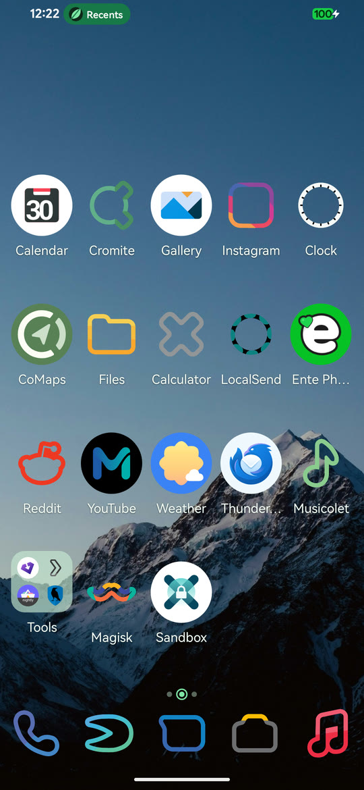</td>
<td width="25%">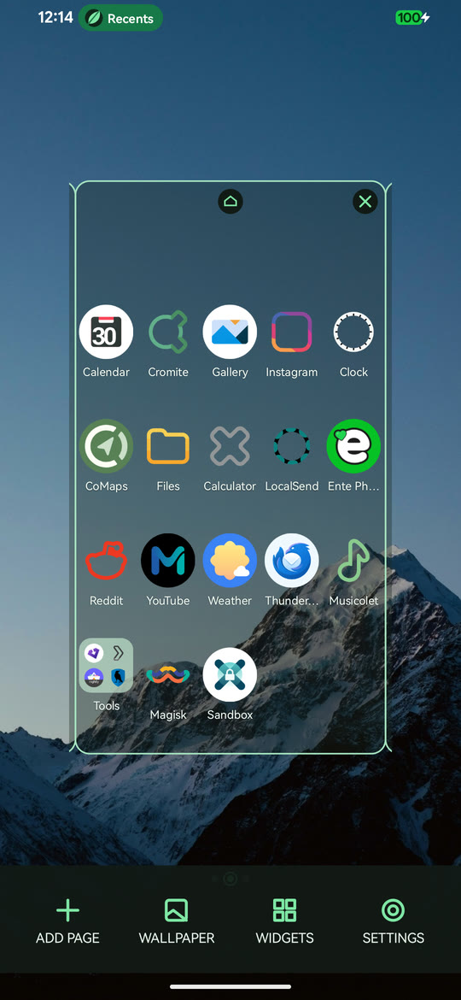</td>
<td width="25%">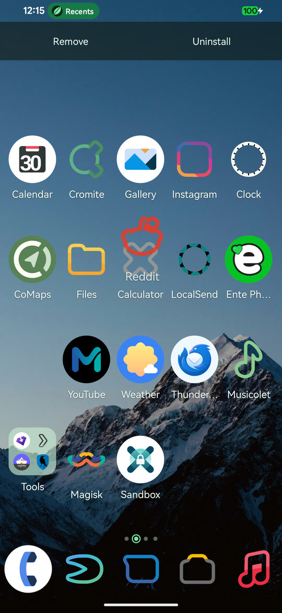</td>
<td width="25%">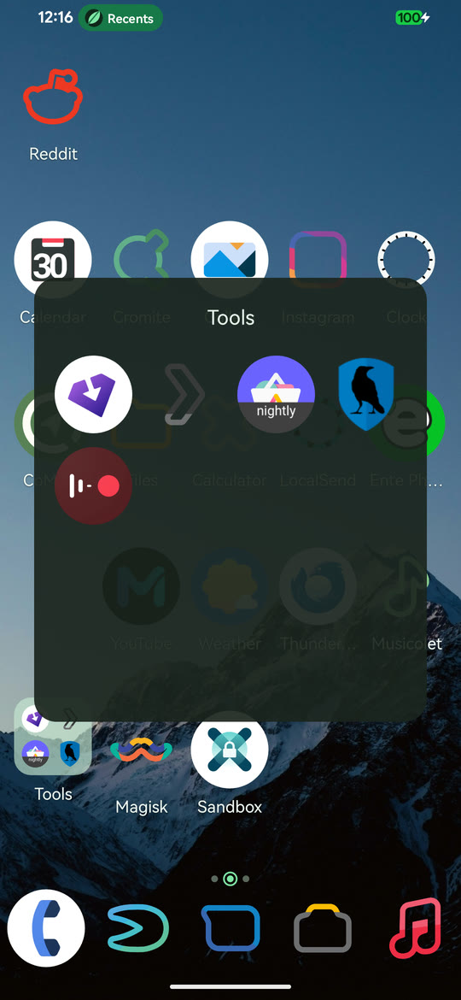</td>
</tr>
<tr>
<td><sub>Your grid, your dock, your wallpaper. The ring in the page dots marks the home page - here
it is the middle one.</sub></td>
<td><sub>Long-press empty space to zoom out. Each page is a card: tap the house to make it home, the
cross to remove it.</sub></td>
<td><sub>Pick an icon up and Remove and Uninstall appear at the top. A spare page opens at the end
while you drag, and is swept away if you do not use it.</sub></td>
<td><sub>Stack two icons to make a folder, then rename it to whatever you like.</sub></td>
</tr>
</table>

### App drawer

<table>
<tr>
<td width="25%">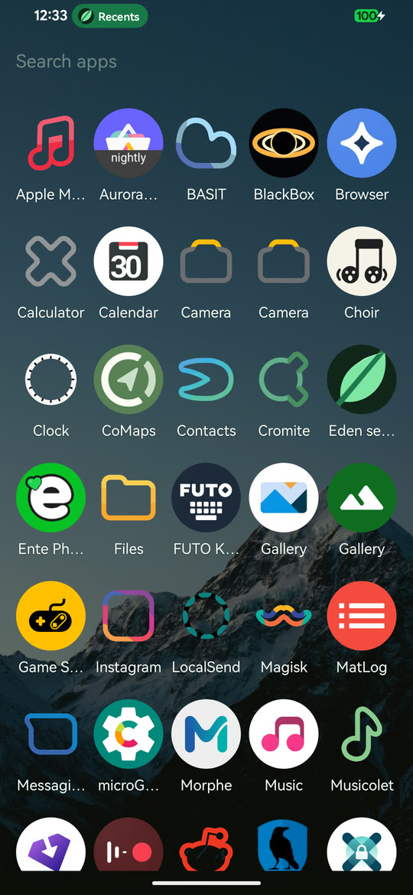</td>
<td width="25%">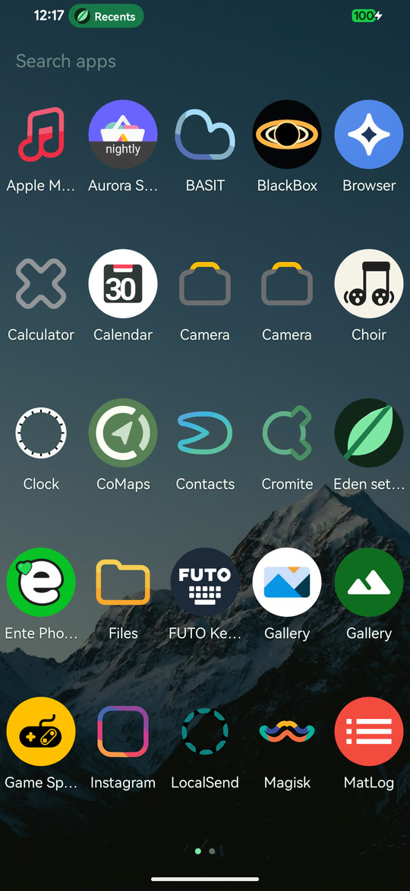</td>
<td width="25%">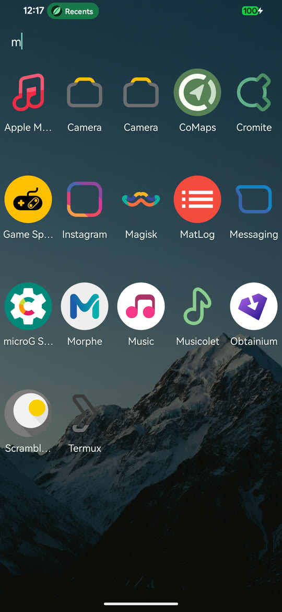</td>
<td width="25%">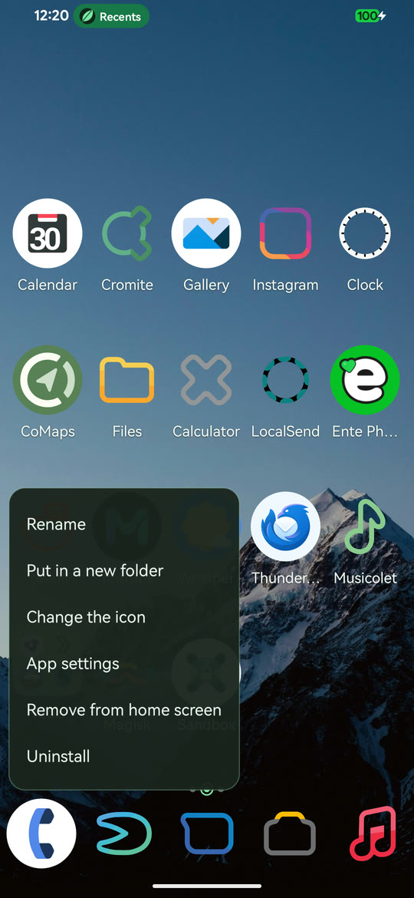</td>
</tr>
<tr>
<td><sub>Vertical scroll: one continuous grid, flung up and down.</sub></td>
<td><sub>Horizontal pages: fixed grids with dots underneath. Same apps, your choice of
gesture.</sub></td>
<td><sub>Search matches anywhere in the name, not just the start - and always against the app's real
name, so a rename can never hide it.</sub></td>
<td><sub>Long-press anything for the same menu, on the home screen or in the drawer.</sub></td>
</tr>
</table>

### Icons

<table>
<tr>
<td width="25%">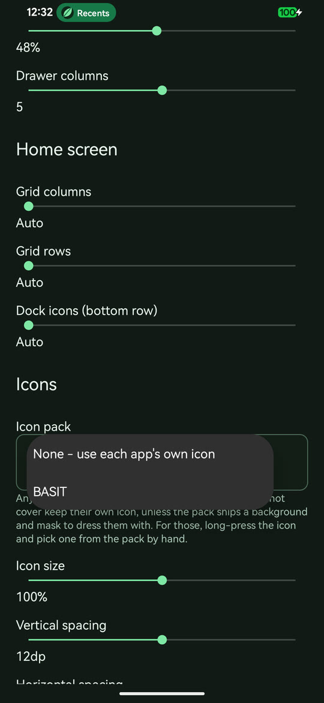</td>
<td width="25%">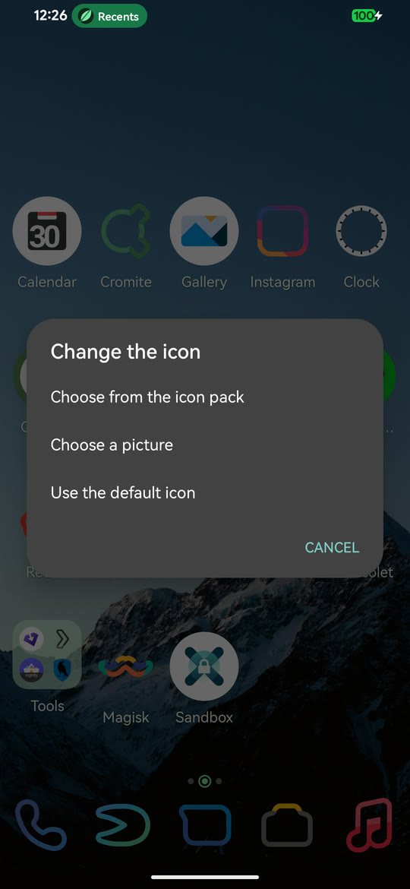</td>
<td width="25%">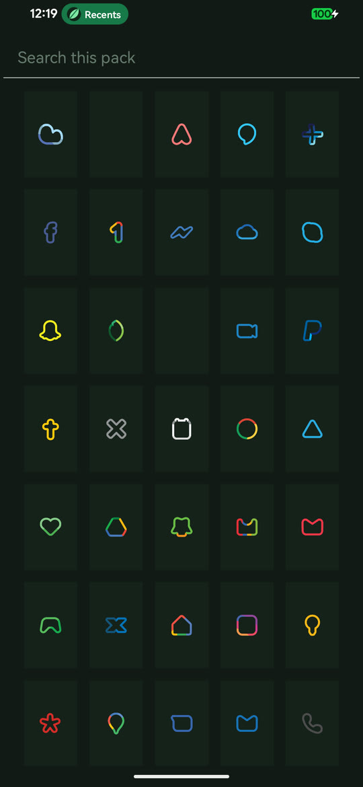</td>
<td width="25%">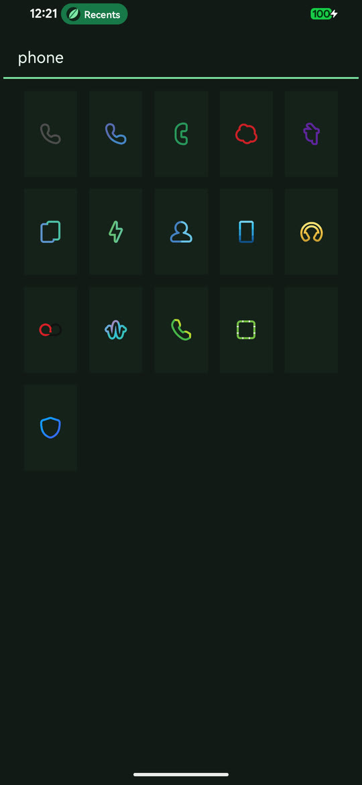</td>
</tr>
<tr>
<td><sub>Every icon pack you have installed, in one dropdown. None is always the first
entry.</sub></td>
<td><sub>Per app: take one from the pack, hand it a picture, or put the original back.</sub></td>
<td><sub>The whole pack as a grid - useful for the apps a pack has no entry for.</sub></td>
<td><sub>Search it by name. Typing "phone" narrows a few thousand drawables to the handful you
meant.</sub></td>
</tr>
</table>

### Wallpapers

<table>
<tr>
<td width="25%">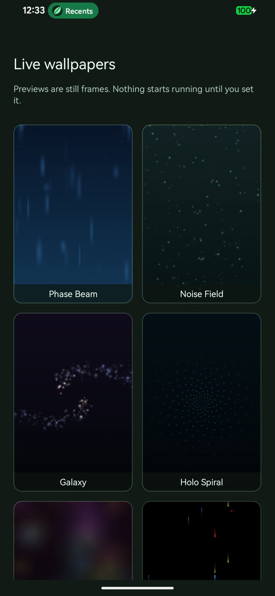</td>
<td width="25%">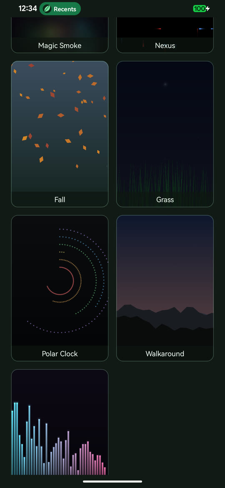</td>
<td width="25%">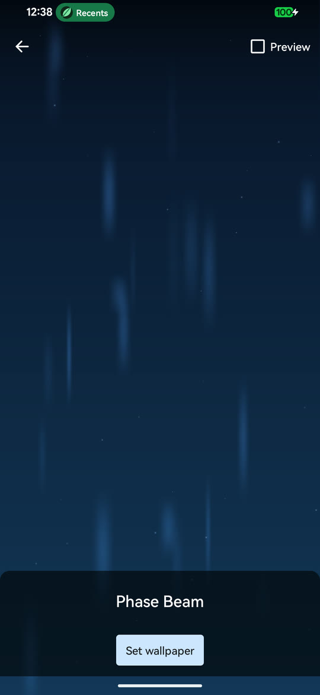</td>
<td width="25%">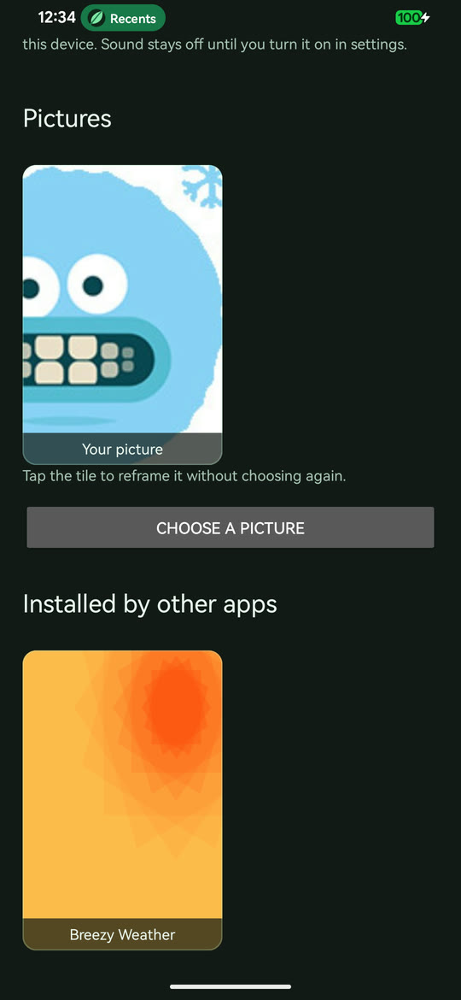</td>
</tr>
<tr>
<td><sub>Eleven wallpapers rewritten from the AOSP originals. Every tile is a real frame rendered
offscreen, not a running service.</sub></td>
<td><sub>Fall, Grass, Polar Clock, Walkaround, Music Visualization - the ones Android stopped
shipping.</sub></td>
<td><sub>Phase Beam, actually running, before you commit to it.</sub></td>
<td><sub>Your own video on a loop, or your own picture, alongside whatever other apps
installed.</sub></td>
</tr>
</table>

<table>
<tr>
<td width="25%">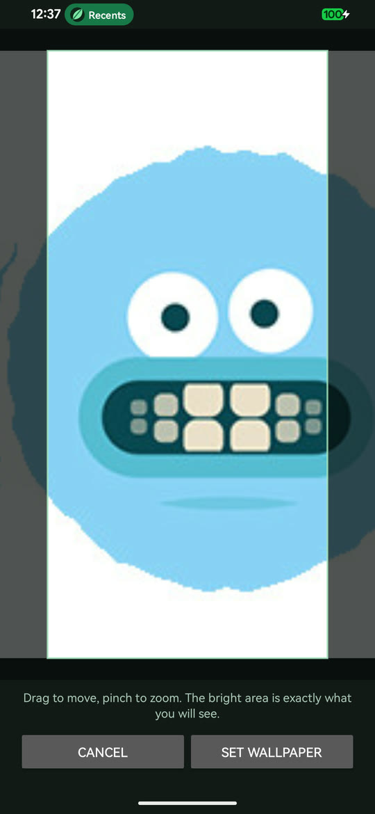</td>
<td width="25%">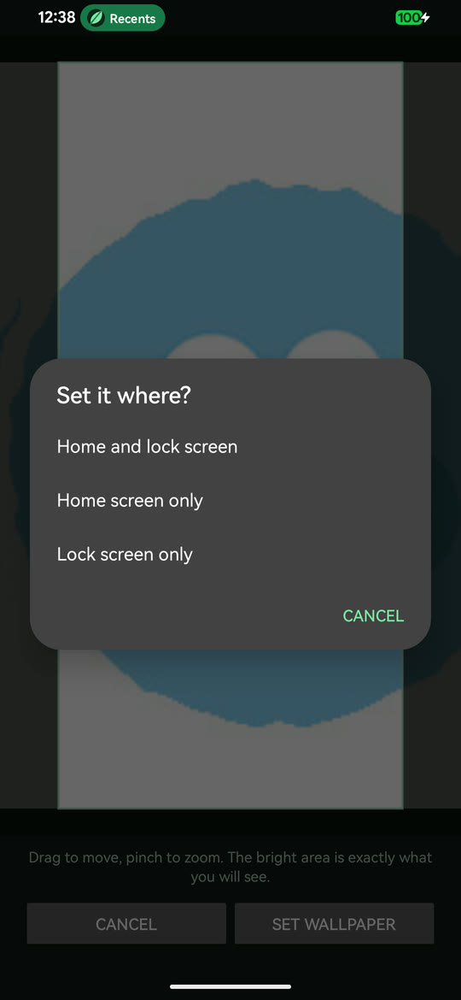</td>
<td width="50%"></td>
</tr>
<tr>
<td><sub>Frame your own picture against the real shape of your screen. The bright area is exactly
what you will see; drag to move, pinch to zoom.</sub></td>
<td><sub>Home screen, lock screen, or both - and you can reframe later without hunting for the photo
again.</sub></td>
<td></td>
</tr>
</table>

### Settings, and the log

<table>
<tr>
<td width="25%">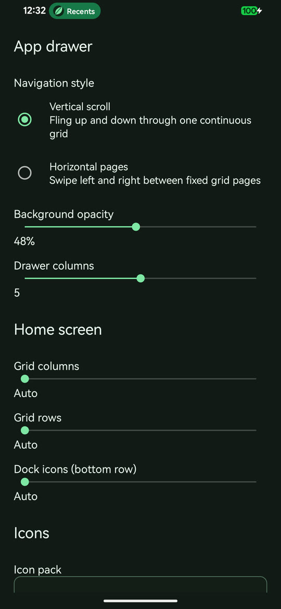</td>
<td width="25%">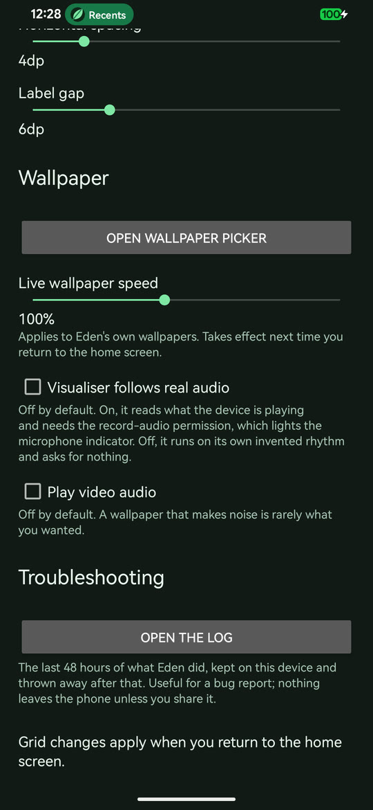</td>
<td width="25%">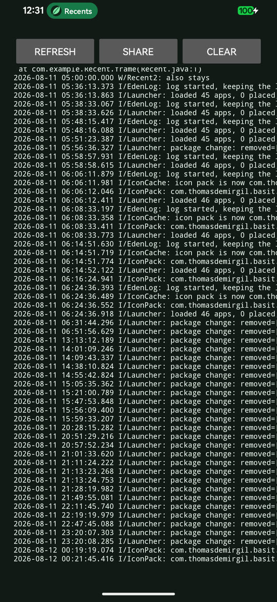</td>
<td width="25%"></td>
</tr>
<tr>
<td><sub>Navigation style, drawer opacity and columns, then the home grid - columns, rows, dock
size, all with an Auto.</sub></td>
<td><sub>Wallpaper speed, the two things that could make noise or use the microphone (both off), and
the way into the log.</sub></td>
<td><sub>The last 48 hours of what Eden did, readable on the device and shared only if you press
Share.</sub></td>
<td></td>
</tr>
</table>

---

## Status

| Phase | Scope | State |
|-------|-------|-------|
| **1** | Foundation - project, models, database, workspace, paging, drag layer | **Done** |
| **2** | Core launcher - loader, drag & drop, app drawer, folders, page management | **Done** (widget hosting deferred) |
| **3** | Live wallpaper - GL engine, eleven bundled wallpapers, video wallpapers, still-frame picker | **Done** |
| **4** | Icons - icon packs, per-app icons, wallpaper cropping, live app list, on-device log | **Done** |
| 5 | Widgets - `AppWidgetHost`, the bind-permission flow, resize frames | Next |

Running on a Galaxy M31 (Android 16, API 36). Release APK is about 800 KB, with no native code.

---

## Build it

| | |
|---|---|
| JDK | 17+ (built against Temurin 25) |
| Android SDK | platform 36, build-tools 36+ |
| Gradle | via the wrapper - do not install Gradle separately |
| Device | Android 10 (API 29) and up |

Put your SDK path in `local.properties` (`sdk.dir=...`; it is gitignored), then:

```sh
./gradlew assembleDebug          # debug APK  -> app/build/outputs/apk/debug/
./gradlew assembleRelease        # minified   -> app/build/outputs/apk/release/
./gradlew installDebug           # push to a connected device
./gradlew lintDebug              # static analysis
```

On Windows use `gradlew.bat`. Release builds are signed with a throwaway key if
`keystore.properties` and `keystore/eden-temp.jks` exist, and stay unsigned if they do not, so a
fresh clone always builds.

The whole toolchain is Kotlin, the Gradle wrapper, and the wrapper's own `sh` / `.bat` scripts. No
Groovy, no Python, no Java sources.

---

## The rules this project follows

Not preferences. Rules.

1. **Target the low end.** Assume a 2-core, 4 GB phone. No allocation in touch handling, layout, or
   draw. Reuse scratch buffers. A row of page dots is a `Canvas` call, not five views.
2. **Every dependency has to earn its place.** The list is: `core-ktx`, `recyclerview`,
   `kotlinx-coroutines`, and Room. No AppCompat, no Material, no `lifecycle-ktx` - that last one
   was dropped for one hand-written `CoroutineScope`. Video wallpapers go through the platform's
   own `MediaCodec` rather than a bundled FFmpeg, which would have been GPL, forty megabytes, and
   unmaintained since January 2025.
3. **Modern APIs, not compatibility shims.** `minSdk 29` exists so the Nougat-era calls can be
   replaced outright: coroutines over `AsyncTask`, `WindowInsets` over `fitSystemWindows`, Room
   over `SQLiteOpenHelper` and a `ContentProvider`.
4. **Never lose the user's arrangement.** The workspace database has no destructive-migration
   fallback. Schema changes ship with a real `Migration`.
5. **Stay readable against the original.** Class and resource names track AOSP Launcher3 so the
   reference sources in `.ref/` stay searchable next to this code.

---

## Layout

```
Eden/
|-- DOCS.MD                     How the pieces fit together
|-- README.MD                   This file
|-- LICENSE / NOTICE            MIT, plus Apache 2.0 for the ported parts
|-- settings.gradle.kts         Modules and repositories
|-- build.gradle.kts            Root build; plugins declared, not applied
|-- gradle/libs.versions.toml   One place for every version
|-- gradlew, gradlew.bat        Wrapper launchers
|-- art/                        The icon mark, and the screenshots above
|-- .ref/                       Pinned AOSP checkouts - gitignored, read-only, never compiled
`-- app/src/main/
    |-- AndroidManifest.xml
    |-- res/                    Layouts, dimens, pastel green theme, adaptive icon
    `-- kotlin/app/auriel/edenlauncher/
        |-- Launcher.kt             Home activity; the only place a gesture becomes a database write
        |-- LauncherModel.kt        Coroutine loader
        |-- LauncherAppState.kt     Process-wide state
        |-- PinItemRequestActivity  "Add to home screen" from other apps
        |-- model/                  ItemInfo, ShortcutInfo, FolderInfo, AppInfo, widgets
        |-- data/                   Room entities, DAO, database, repository
        |-- device/                 Grid metrics
        |-- views/                  PagedView, Workspace, CellLayout, DragLayer, Hotseat, overview
        |-- dragndrop/              DragController and drop-target contracts
        |-- folder/                 Folder and FolderIcon
        |-- allapps/                The two drawer modes and their shared search
        |-- wallpaper/              GL engine, the eleven wallpapers, video, picker, cropper
        |-- icons/                  Icon packs, the in-pack browser, per-app overrides
        |-- media/                  MediaCodec video transcoder
        |-- settings/               Preferences and the settings screen
        |-- widget/                 Placeholder until hosting lands
        `-- util/                   Icon cache, user cache, bitmap helpers, the on-device log
```

---

## Licence and origins

Eden is MIT. Parts of it are ported from AOSP Launcher3 and from the AOSP live wallpapers, which
are Apache 2.0 - those files say so in their header and are listed in `NOTICE`. `.ref/` holds
unmodified AOSP Launcher3 checkouts (Android 7, 8, and 10) used for reading only; they are
gitignored and never compiled.

The wallpapers were never in Launcher3 - they live in their own AOSP repositories, and the ones
that survive there are still RenderScript, which the Android Gradle plugin dropped in 9.0. So they
could not have been copied even in principle: every one here was written fresh against OpenGL ES
2.0, keeping the composition and the palette.

**Is it a fork or a rewrite?** Neither word is quite honest on its own, so: it is a **rewrite that
is also a derivative work**.

Not a fork in the usual sense - it shares no source files and no git history with Launcher3.
Nothing was patched or carried over; every file here was written fresh in Kotlin, and the
architecture diverges where it should (Room instead of a ContentProvider, coroutines instead of a
loader thread, an interface between the views and the database).

But it was written with the original open on the other monitor, and plenty came across: the class
decomposition, the drag and drop protocol, the paging maths down to the exact fling thresholds and
the velocity-scaled snap duration, the device profile table's numbers, the database column names.
That is a derivative work, which is why Apache 2.0 still applies to those parts and why `NOTICE`
names each file and the class it came from rather than waving at "inspired by AOSP".

It is not clean-room either. Clean-room means one person reads and writes a spec and another
implements from the spec alone. Nobody did that here.

---

Bugs, ideas, disagreements: **debadityamalakar@gmail.com**
